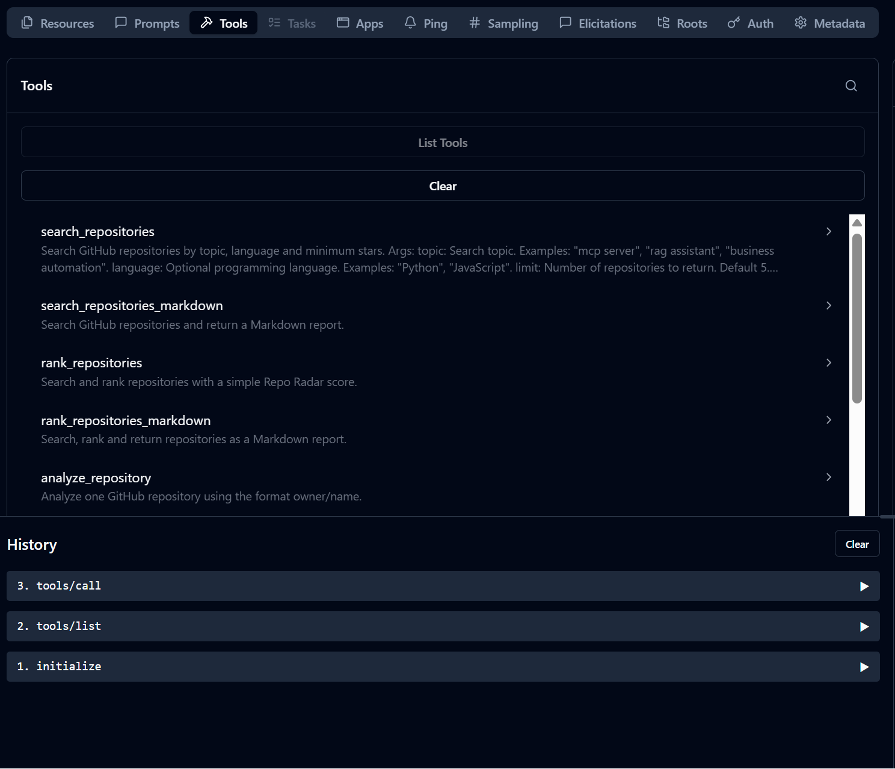
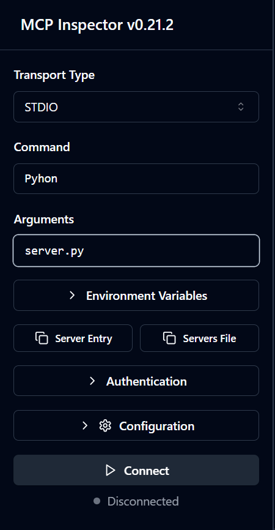
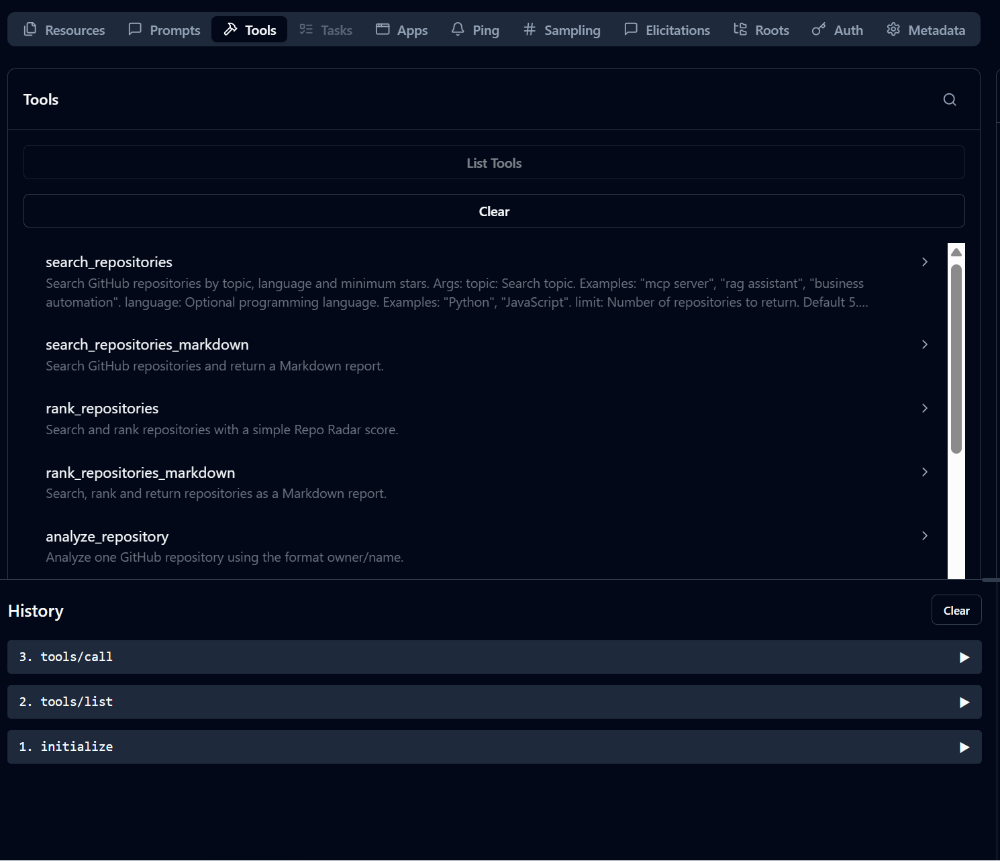
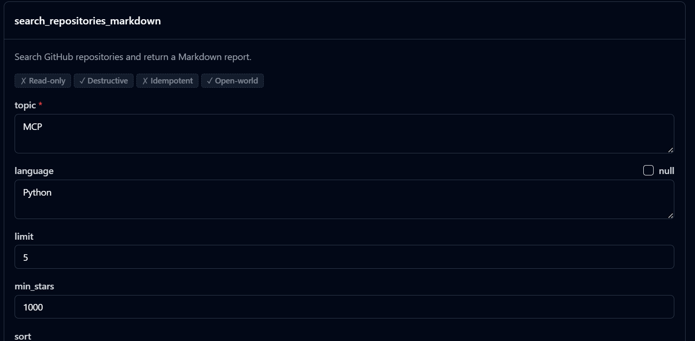
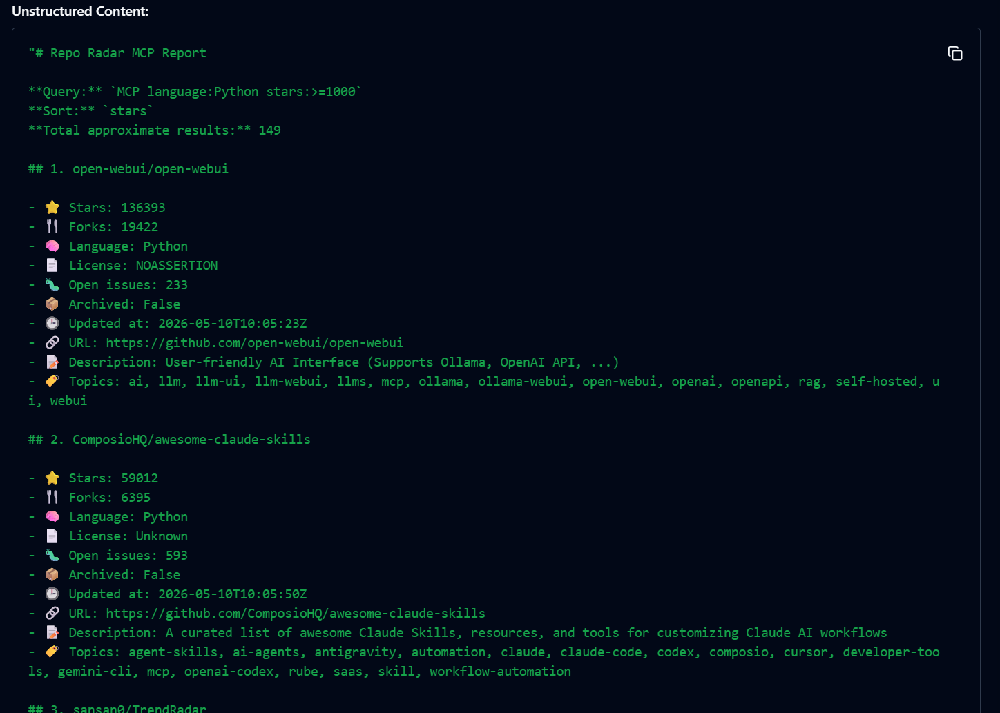
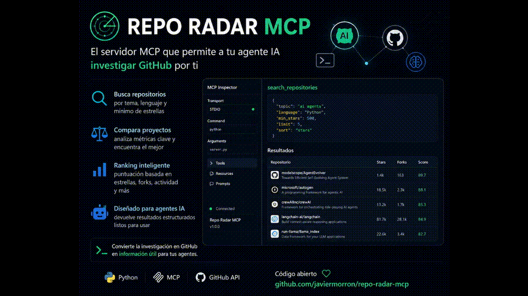

# Repo Radar MCP

> Discover, rank and compare GitHub repositories from any MCP-compatible AI client.


---

## 🚀 What is Repo Radar MCP?

**Repo Radar MCP** is a Python-based MCP server that allows AI agents and MCP-compatible clients to search, rank, analyze and compare GitHub repositories using the GitHub API.

It helps developers, builders and AI agents answer one important question:

> Which open-source repository is actually worth studying, using or comparing for my next project?

Instead of manually browsing GitHub, opening multiple tabs and comparing stars, licenses, activity and README files by hand, Repo Radar MCP gives your AI client a structured way to research repositories directly.

---

## 🎯 Why this project exists

AI agents can write code, generate ideas and help build products.

But they still need **good technical context**.

When you are starting a new project, you often need to know:

* Which repositories are popular around a topic.
* Which projects are still active.
* Which repositories have a license.
* Which ones are good references to study.
* Which repo has better signals: stars, forks, issues, activity and documentation.
* Which tools are worth comparing before making a technical decision.

Repo Radar MCP turns that research process into a tool your AI assistant can use.

---

## ✨ Features

* ✅ Search GitHub repositories by topic.
* ✅ Filter by programming language.
* ✅ Filter by minimum stars.
* ✅ Sort by stars, forks, updated date or relevance.
* ✅ Rank repositories with a practical usefulness score.
* ✅ Analyze a single repository.
* ✅ Compare multiple repositories.
* ✅ Fetch repository README content.
* ✅ Return results as JSON or clean Markdown.
* ✅ Use GitHub token safely from environment variables.
* ✅ Works with MCP Inspector, Claude Desktop, Cursor and other MCP-compatible clients.

---

## 🧠 How it works

```text
AI Client
   ↓
MCP Tool Call
   ↓
Repo Radar MCP Server
   ↓
GitHub API
   ↓
Repository Analysis
   ↓
JSON / Markdown Result
```

The server exposes several MCP tools that can be called by an AI client.

For example, your assistant can ask Repo Radar MCP to:

* Search repositories about `rag assistant`.
* Filter only Python repositories.
* Rank them by usefulness.
* Compare several repositories.
* Read the README of a selected repository.
* Return a Markdown report that is easy to review.

---

## 🛠️ MCP Tools

| Tool                            | Description                                                            |
| ------------------------------- | ---------------------------------------------------------------------- |
| `search_repositories`           | Search GitHub repositories by topic, language, stars and sorting mode. |
| `search_repositories_markdown`  | Same as above, but returns a clean Markdown report.                    |
| `rank_repositories`             | Search repositories and add a practical repository score.              |
| `rank_repositories_markdown`    | Search, rank and return repositories as Markdown.                      |
| `analyze_repository`            | Analyze one repository by `owner/name`.                                |
| `analyze_repository_markdown`   | Analyze one repository and return a Markdown report.                   |
| `compare_repositories`          | Compare several repositories by `owner/name`.                          |
| `compare_repositories_markdown` | Compare several repositories and return a Markdown table.              |
| `get_repository_readme`         | Fetch the README of a repository.                                      |

---

## ⚡ Quick Start

### 1. Clone the repository

```bash
git clone https://github.com/javiermorron/repo-radar-mcp.git
cd repo-radar-mcp
```

### 2. Create a virtual environment

#### Windows PowerShell

```bash
python -m venv .venv
.\.venv\Scripts\activate
```

#### macOS / Linux

```bash
python -m venv .venv
source .venv/bin/activate
```

### 3. Install the project

```bash
pip install -e .
```

### 4. Configure your GitHub token

Copy the example environment file:

```bash
cp .env.example .env
```

On Windows PowerShell:

```bash
copy .env.example .env
```

Edit `.env`:

```env
GITHUB_TOKEN=your_github_token_here
GITHUB_API_VERSION=2022-11-28
GITHUB_USER_AGENT=repo-radar-mcp/1.0.0
```

> Never commit your real `.env` file.

---

## ▶️ Run with MCP Inspector

From the project root:

```bash
mcp dev server.py
```

If MCP Inspector does not find `uv`, use this manual configuration:

```text
Transport Type: STDIO
Command: python
Arguments: server.py
```

Then open the **Tools** tab and test a request like:

```json
{
  "topic": "mcp server",
  "language": "Python",
  "limit": 5,
  "min_stars": 10
}
```

---

## 🧩 Claude Desktop Example

A sample configuration is available in:

```text
examples/claude_desktop_config.example.json
```

Example Windows configuration:

```json
{
  "mcpServers": {
    "repo-radar-mcp": {
      "command": "C:\\Users\\YOUR_USER\\repo-radar-mcp\\.venv\\Scripts\\python.exe",
      "args": [
        "C:\\Users\\YOUR_USER\\repo-radar-mcp\\server.py"
      ]
    }
  }
}
```

---

## 💬 Example prompts

You can ask your MCP-compatible assistant things like:

```text
Search the 5 most popular Python repositories about "mcp server" and explain which one is best to study.
```

```text
Compare these repositories: modelcontextprotocol/python-sdk, langchain-ai/langchain, run-llama/llama_index.
```

```text
Find popular repositories about "rag assistant" in Python with more than 500 stars and rank them by usefulness.
```

```text
Analyze microsoft/autogen and tell me if it is active, useful and worth studying.
```

```text
Find GitHub repositories related to AI agents, compare them and suggest which one could inspire a new MVP.
```

More prompts are available in:

```text
examples/prompts.md
```

---

## 📊 Repository Score

Repo Radar MCP includes a simple scoring system based on practical repository signals:

* Stars
* Forks
* Recent activity
* License availability
* Open issues
* Archived status

The score is not meant to replace human judgment.

It is a quick signal to help agents and developers decide what to inspect first.

---

## 📸 Screenshots and demo

This project includes visual assets in the `assets/` folder to show how Repo Radar MCP works inside MCP Inspector.

```text
assets/
├── repo-radar-banner.png
├── mcp-inspector-connection.png
├── mcp-inspector-tools.png
├── search-repositories-markdown-form.png
├── markdown-report-example.png
└── Demo.mp4
```

### Project banner



### MCP Inspector connection

Configure MCP Inspector using `STDIO` transport with:

```text
Command: python
Arguments: server.py
```



### Available MCP tools

Repo Radar MCP exposes several tools that can be tested directly from MCP Inspector.



### Search repositories form

Use `search_repositories_markdown` to search GitHub repositories and return a clean Markdown report.



### Markdown report example

Repo Radar MCP can return structured Markdown reports with repository name, stars, forks, license, open issues, update date, URL, description and topics.



### Demo video

Watch Repo Radar MCP running inside MCP Inspector:



> If the video does not preview correctly on GitHub, upload it as a release asset or replace it with a short GIF.

---

## 🧪 Example output

Example Markdown result:

```markdown
# Repository Ranking: mcp server

| Repository | Stars | Forks | License | Updated | Score |
|---|---:|---:|---|---|---:|
| modelcontextprotocol/python-sdk | 9000+ | 800+ | MIT | Recently updated | 92 |
| example/mcp-server | 1200+ | 150+ | Apache-2.0 | Active | 78 |

Recommendation:
Start with the official SDK if you need a reliable reference implementation.
```

---

## 🧱 Project Structure

```text
repo-radar-mcp/
│
├── src/
│   └── repo_radar_mcp/
│       ├── __init__.py
│       ├── server.py
│       ├── github_client.py
│       ├── scoring.py
│       ├── formatters.py
│       └── models.py
│
├── examples/
│   ├── claude_desktop_config.example.json
│   └── prompts.md
│
├── tests/
│   └── test_scoring.py
│
├── .env.example
├── .gitignore
├── CHANGELOG.md
├── LICENSE
├── README.md
├── pyproject.toml
├── requirements.txt
└── server.py
```

---

## 🔐 Security

Repo Radar MCP uses a GitHub token from environment variables.

Do not commit:

* `.env`
* Personal access tokens
* Private API keys
* Local virtual environments
* Temporary files

The `.gitignore` file already excludes common sensitive and generated files.

Recommended GitHub token permissions:

* Public repository read access is enough for public repository research.
* Avoid broad permissions unless you know exactly why you need them.
* Use a dedicated token for this project.

---

## 🗺️ Roadmap

* [ ] Add repository release analysis.
* [ ] Add issue quality analysis.
* [ ] Add contributor activity metrics.
* [ ] Add repository health report.
* [ ] Add topic recommendation support.
* [ ] Add CSV and JSON export helpers.
* [ ] Add Docker support.
* [ ] Add GitHub Actions for tests and linting.
* [ ] Add richer README analysis.
* [ ] Add examples for Cursor and Claude Desktop.
* [ ] Add demo GIFs and screenshots.

---

## 🧠 Use cases

Repo Radar MCP can help with:

* Researching open-source tools before starting a project.
* Comparing AI agent frameworks.
* Finding MCP servers worth studying.
* Discovering useful Python repositories.
* Building technical reports from GitHub data.
* Helping AI agents choose better technical references.
* Creating content around open-source tools and developer trends.

---

## 🤝 Contributing

Contributions are welcome.

Good first issues:

* Improve scoring logic.
* Add more output formats.
* Add tests.
* Improve MCP client examples.
* Add Docker support.
* Add screenshots and demo GIFs.
* Improve README analysis.

Before contributing, feel free to open an issue with your idea.

---

## ⭐ Support the project

If this project helps you discover better repositories, compare technical options or build smarter AI workflows, consider leaving a star on GitHub.

It helps more developers find the project and motivates future improvements.

---

## 👤 Author

**Javier Morrón**
Consultant in Applied Artificial Intelligence and Automation.

I help professionals, small businesses and independent builders save time, reduce manual work and improve internal processes using artificial intelligence, AI agents and automation.

LinkedIn: [https://www.linkedin.com/in/javiermorron](https://www.linkedin.com/in/javiermorron)

---

## 📄 License

This project is licensed under the MIT License.

You can use it, modify it and adapt it to your own needs while keeping the corresponding attribution.
